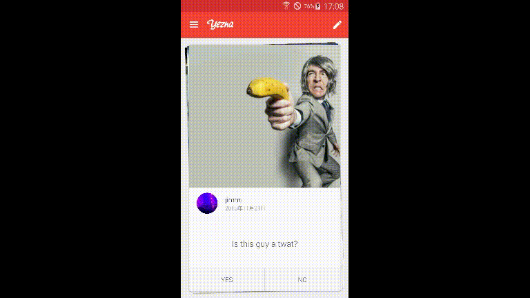

# Yezna

A yes-no question app currently using a Rails backend.

Users post questions and are able to track answers from others users.

    

## New things I tried

* RxJava as event bus
* Page Object pattern with Espresso
* Experimenting with view animations

## TODO

* Polish profile screen
* Find a better way to track answered public questions
* Responsive UI
* Further testing for production readiness